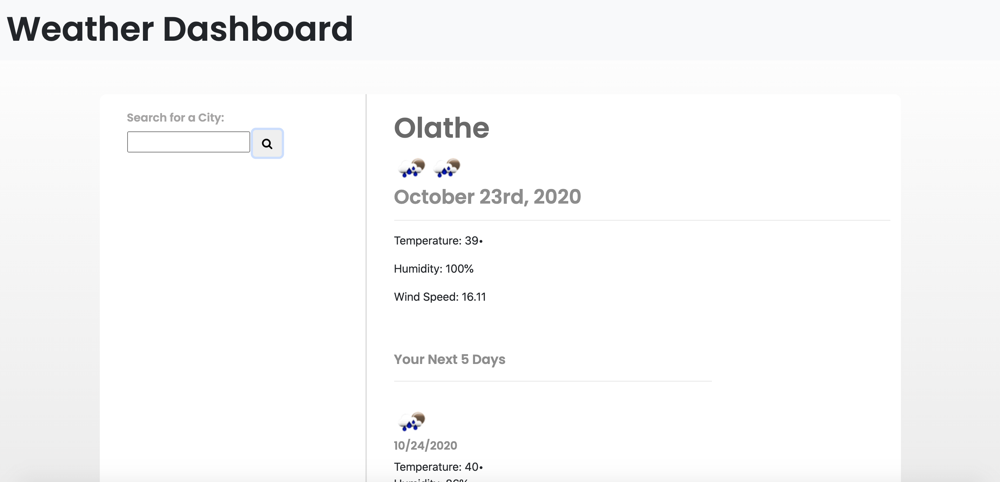

# 06_Weather_Dashboard
For this project, we had to create a weather dashboard with data that would persist. 

# Still Struggling With...
I can't figure out why my UV index won't show up when the URL is correct in console.log. I also had a lot of issues with my local storage. I am trying really hard to understand and figure it out, but it hasn't clicked yet. I thought it would fix when I figured out how to change the city with my search, but it still shows as undefined, which ruined my data from the past array that was supposed to persist. I know this is incomplete, but my goal is to revamp and ask to be regraded later if needed when I have a better handle on how to fix my issues. 

# Screenshot

